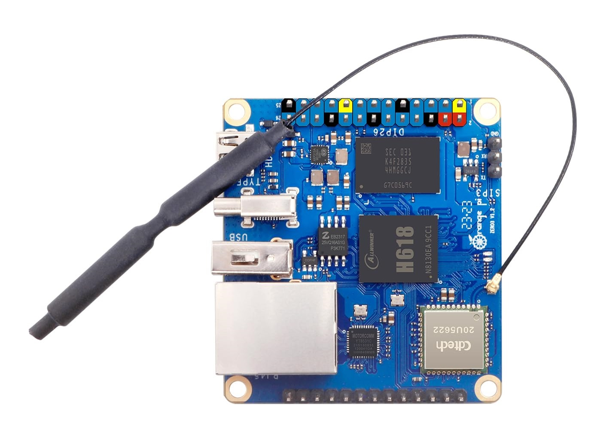

# Servidor en orange pi Zero 3 (4gb) con armbian (in progress...)
- Instalación de un pequeño servidor Nginx en una Orange pi Zero 3 (en nuestro caso de 4gb)

<p align="center" width="100%"><a></a></p>

- Vamos a seguir los pasos correctos para preparar la tarjeta SD para tu Orange Pi Zero 3 con 4GB de RAM usando la imagen de Armbian y los archivos de U-Boot y DTB los podemmos encontar en los repositorios de armbian-images: 

<a href="https://github.com/leeboby/armbian-images"></a>
[armbian-images](https://github.com/leeboby/armbian-images)


### Dentro de armbian tienes estas 4 imagenes para:

- Ubuntu con xfce
- Ubuntu server
- Debian con xfce
- Debian server

### Además de el bootloader y el árbol de dispositivos (DTB) para versiones:

- 1.5Gb a 3Gb
- 4Gb
  
# Descargar la imagen:
oizero3 1GB2GB. 	Servidor de debian12

<a href="https://github.com/leeboby/armbian-images/releases/download/opizero3/Armbian_23.08.0-trunk_Orangepizero3_bookworm_current_6.1.31-1GB-2GB.img.xz
"></a>


# Descargar los archivos archivos necesarios para instalar un bootloader y el árbol de dispositivos (DTB) :
OPi Zero3 1.5gb-4g.

4g.u-boot.bin: 4gb.u-boot.bin.

<a href="https://github.com/leeboby/opizero3-uboot-kernel/blob/main/u-boot-sunxi-with-spl-opizero3-4gb.bin"></a>


4gb.dtb.: 4gb.dtb.

<a href="https://github.com/leeboby/opizero3-uboot-kernel/blob/main/sun50i-h616-orangepi-zero3-4gb.dtb"></a>


### Paso 1: Descomprimir la imagen `.xz`

Tienes la imagen comprimida **`Armbian_23.08.0-trunk_Orangepizero3_bookworm_current_6.1.31-1GB-2GB.img.xz`**, así que primero debes descomprimirla:

1. Abre una terminal y ve a la carpeta donde está la imagen `.xz`.
2. Descomprime la imagen con el siguiente comando:

   ```bash
   unxz Armbian_23.08.0-trunk_Orangepizero3_bookworm_current_6.1.31-1GB-2GB.img.xz
   ```

   Esto generará un archivo **`Armbian_23.08.0-trunk_Orangepizero3_bookworm_current_6.1.31-1GB-2GB.img`**.

### Paso 2: Grabar la imagen en la tarjeta SD

Ahora que tienes la imagen descomprimida, puedes grabarla en la tarjeta SD. Utiliza **`dd`** o una herramienta gráfica como **Raspberry Pi Imager**.

Si prefieres usar la terminal, primero identifica la tarjeta SD (asegurándote de que no es el disco duro principal) con el siguiente comando:

```bash
lsblk
```

Para mi tarjeta e 32gb y mi unidad sdb debería mostrarte algo como:

```
/dev/sdb  29.5G
```

Aquí, **`/dev/sdb`** es tu tarjeta SD. **¡Ten mucho cuidado con este paso!** Si seleccionas el disco equivocado, podrías sobrescribir tus datos importantes.

Luego, graba la imagen con **`dd`**: Importante Modifica sdb (por tu unidad, si no fuera esta)

```bash
sudo dd if=Armbian_23.08.0-trunk_Orangepizero3_bookworm_current_6.1.31-1GB-2GB.img of=/dev/sdb bs=4M status=progress conv=fsync
```

### Paso 3: Montar la tarjeta SD y copiar los archivos de configuración

Una vez que la imagen esté grabada en la tarjeta SD, **monta la partición de arranque** para copiar los archivos de **U-Boot** y **DTB**.

1. Monta la partición de arranque de la tarjeta SD: (cambia sdb1 por tu unidad)

   ```bash
   sudo mount /dev/sdb1 /mnt
   ```

   (Asegúrate de que `/dev/sdb1` es la partición correcta, que normalmente es la **partición de arranque** de la tarjeta SD).

2. Copia el archivo **`sun50i-h616-orangepi-zero3-4gb.dtb`** a la carpeta **`/boot/dtb/allwinner/`**:

   ```bash
   sudo cp sun50i-h616-orangepi-zero3-4gb.dtb /mnt/boot/dtb/allwinner/sun50i-h616-orangepi-zero3.dtb
   ```

### Paso 4: Escribir el bootloader (`u-boot`) en la tarjeta SD

1. **Escribe el archivo de bootloader** `u-boot-sunxi-with-spl-opizero3-4gb.bin` en la tarjeta SD usando **`dd`**:
2.  Reemplaza **`/dev/sdb`** por el dispositivo correcto

   ```bash
   sudo dd bs=1k seek=8 if=u-boot-sunxi-with-spl-opizero3-4gb.bin of=/dev/sdb
   ```

  
   - **El parámetro `seek=8` asegura que el bootloader se grabe correctamente** a partir del lugar adecuado en la tarjeta SD.

### Paso 5: Desmontar la tarjeta SD y ponerla en la Orange Pi Zero 3

Una vez que hayas copiado los archivos y actualizado el bootloader:

1. Desmonta la tarjeta SD:

   ```bash
   sudo umount /mnt
   ```

2. **Coloca la tarjeta SD en tu Orange Pi Zero 3** y enciéndelo.

Ahora deberías poder arrancar tu **Orange Pi Zero 3** utilizando la imagen de **Armbian** y los archivos de configuración correctos para **4GB de RAM**.


# Arrancando el sistema

## Si no deseas conectar un monitor configuraremos a traves de SSH desde nuestro PC

---

### **1. Configurar la conexión de red (Wi-Fi o Ethernet)**
- **Si usas Ethernet**: Conecta la Orange Pi a tu router con un cable. Obtendrá IP automáticamente (DHCP).
- **Si usas Wi-Fi**:
  - Inserta la tarjeta microSD en tu computadora.
  - En la partición `boot` (primera partición), crea un archivo llamado `wpa_supplicant.conf` con este contenido:
     ```conf
     ctrl_interface=DIR=/var/run/wpa_supplicant GROUP=netdev
     update_config=1
     country=TU_CODIGO_PAIS (ej: ES, MX, AR)

     network={
         ssid="NOMBRE_RED_WIFI"
         psk="CONTRASEÑA_WIFI"
         key_mgmt=WPA-PSK
     }
     ```
  - Guarda el archivo y extrae la tarjeta SD.

---

### **2. Obtener la IP de la Orange Pi**
- **Opción A (Recomendada)**: Revisa la lista de dispositivos conectados en tu router (busca "Orange Pi" o direcciones MAC que empiecen con `02:81` o similar).
- **Opción B**: Usa un escáner de IP en tu computadora:
  - **Linux/macOS**: 
    ```bash
    nmap -sn 192.168.1.0/24 # Ajusta la red según tu router
    ```

---

### **3. Conectar por SSH**
- **Usuario y contraseña predeterminados** de Armbian:
  - Usuario: `root` / Contraseña: `1234` (te pedirá cambiarla en el primer login).
  - Otra opción: `orangepi`/`orangepi` (depende de la imagen).
  
  ```bash
  ssh root@IP_DE_LA_ORANGE_PI
  ```
  Ejemplo:
  ```bash
  ssh root@192.168.1.144
  ```

---

### **4. Solucionar problemas comunes**
- **"Connection refused"**: Asegúrate de que el servicio SSH está activo. Crea un archivo vacío llamado `ssh` en la partición `boot` de la SD.
- **"Password incorrecto"**: Si no funciona `1234`, prueba con `orangepi` o revisa la documentación de tu imagen de Armbian.
- **No encuentra la IP**: Usa el comando `ping orangepi.local` (si tu red soporta mDNS).

---

### **5. Configuraciones posteriores (opcional)**
- **Cambiar contraseña**: Obligatorio tras el primer login.
- **Crear un usuario nuevo**:
  ```bash
  adduser nombre_usuario
  usermod -aG sudo nombre_usuario
  ```
- **Habilitar acceso sin contraseña (SSH Keys)**:
  ```bash
  ssh-copy-id nombre_usuario@IP_DE_LA_ORANGE_PI
  ```

---
# Instalanado servidor Nginx y una base de datos

### Instalación de Nginx

1. **Actualizar el sistema**:
   ```sh
   sudo apt-get update
   ```

2. **Instalar Nginx**:
   ```sh
   sudo apt-get install nginx
   ```

3. **Iniciar el servicio de Nginx**:
   ```sh
   sudo systemctl start nginx
   ```

4. **Verificar la instalación**:
   - Abre tu navegador web e introduce la dirección IP de tu servidor. Deberías ver la página de bienvenida de Nginx.

5. **Habilitar Nginx para que se inicie automáticamente**:
   ```sh
   sudo systemctl enable nginx
   ```

### Instalación de MariaDB

1. **Instalar MariaDB**:
   ```sh
   sudo apt-get install mariadb-server
   ```

2. **Iniciar el servicio de MariaDB**:
   ```sh
   sudo systemctl start mariadb
   ```

3. **Habilitar MariaDB para que se inicie automáticamente**:
   ```sh
   sudo systemctl enable mariadb
   ```

4. **Configurar MariaDB**:
   - Ejecuta el siguiente comando para asegurar la instalación:
   ```sh
   sudo mysql_secure_installation
   ```

### Configuración de Nginx para usar MariaDB

1. **Instalar PHP y módulos necesarios**:
   ```sh
   sudo apt-get install php-fpm php-mysql
   ```

2. **Configurar Nginx para usar PHP**:
   - Edita el archivo de configuración de Nginx:
   ```sh
   sudo nano /etc/nginx/sites-available/default
   ```
   - Añade las siguientes líneas dentro del bloque `server`:
   ```nginx
   location ~ \.php$ {
       include snippets/fastcgi-php.conf;
       fastcgi_pass unix:/var/run/php/php7.4-fpm.sock;
   }
   ```

3. **Reiniciar Nginx**:
   ```sh
   sudo systemctl restart nginx
   ```

### Verificación

1. **Crear un archivo PHP de prueba**:
   ```sh
   sudo nano /var/www/html/info.php
   ```
   - Añade el siguiente contenido:
   ```php
   <?php phpinfo(); ?>
   ```

2. **Acceder al archivo de prueba**:
   - Abre tu navegador web e introduce `http://<tu_direccion_ip>/info.php`. Deberías ver la página de información de PHP.

